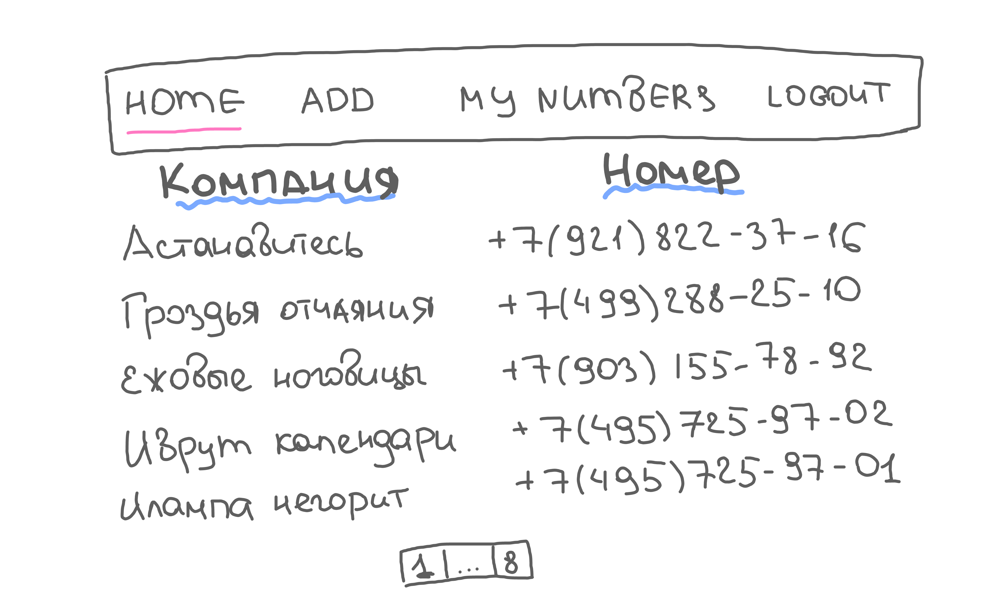
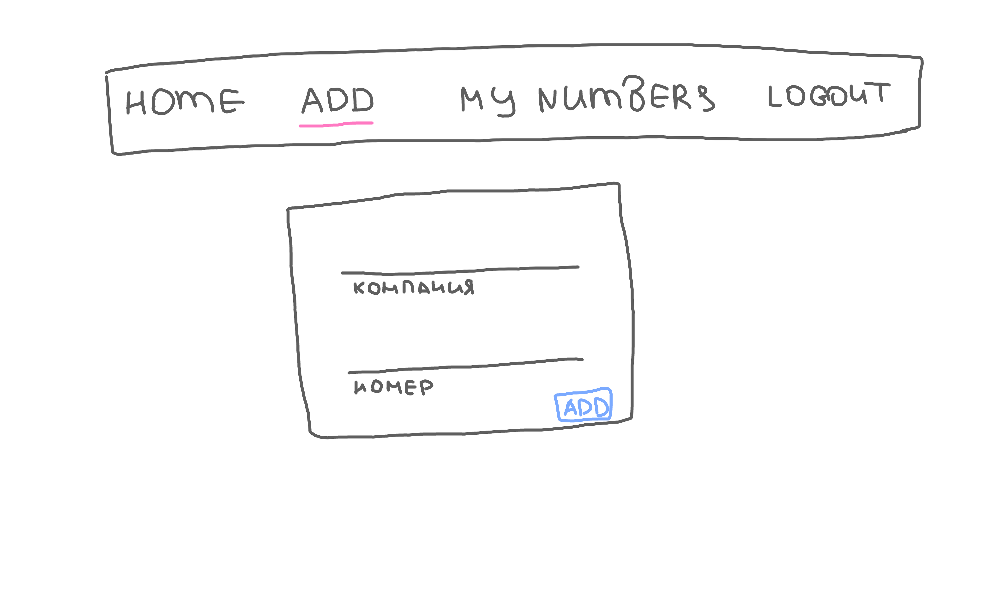
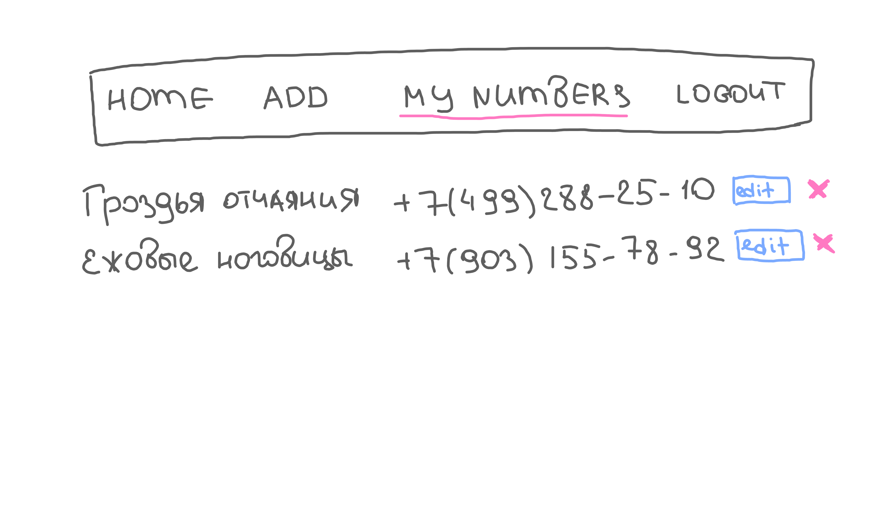

# неЖёлтые страницы

### Введение
Необходимо создать базу телефонных номеров Компаний (раньше для этого существовал справочник "Жёлтые страницы"). Пользователи твоего приложения смогут добавлять названия Компаний и телефонные номера для общего доступа, а также просматривать все имеющиеся номера.

*Важно:*
Делай  `git push`  только один раз (в 16.00), в течение экзамена ничего пушить не нужно!

**Сначала прочитай всё задание целиком!**
Если не получается сделать какой-то релиз, переходи к следующему.

### Pre-release: Setup
Убедись, что в твоем проекте есть файл .gitignore, package.json и установлены все необходимые библиотеки. Создай базу данных. Проинициализируй eslint.

### Release 0: 
Первое, что нужно сделать - это продумать архитектуру базы данных, а также все страницы твоего приложения.
Приложение может выглядеть следующим образом:
- "/" главная страница сайта (отображает все имена и телефонные номера в алфавитном порядке);
- "/signup" форма регистрации пользователя в приложении;
- "/signin" форма входа пользователя в приложении;
- "/add" форма добавления новой Компании и её телефонного номера;
- "/mynumbers" страница с отображением всех компаний и телефонных номеров, добавленных пользователем. На этой странице можно редактировать и удалять те записи, которые были добавлены пользователем (не забдь защитить этот функционал на бэке)
  
*Рисунок 1*. Макеты главной страницы.

### Release 1: Login/Logout
Добавь в шапку сайта кнопку "login", ведущую на соответствующую страницу. Не забудь обрабатывать ошибки: если у пользователя не получается залогиниться - ему нужно знать причину. При успешном входе - вместо кнопки "login" должна появляться "logout". При нажатии на logout пользователь выходит из системы и оказывается на домашней странице. На данном этапе домашняя страница может быть пустой, позже на ней будут отображаться все имеющиеся Компании и их телефонные номера.

### Release 2: 
Пришло время создать сиды с Компаниями и их телефонными номерами. Засидь свою базу данных достаточным количеством данных. На этом этапе нужно сделать так, чтобы Компании (с их телефонными номерами) отображались на главной странице в афлавитном порядке. Будет здорово, если на этой странице будет пагинация (если никогда этого не делал - отложи пагинацию напоследок).

### Release 3:
Сделай страницу с добавлением Компании и телефонного номера ("/add"). Помни, что при добавлении новой записи она должна попасть в нужное место алфавитного порядка на главной странице. (возможно, в этом тебе поможет `useEffect`, вот только где и как его написать 🤔)

  
*Рисунок 1*. Макеты главной страницы.

### Release 4:
Сделай страницу с отображением всех Компаний и номеров, добавленных пользователем ("/mynumbers"). На этой странице нужно реализовать функционал редактирования и удаления номеров. Не забудь сделать этот функционал доступным только создателю текущей записи. Что если злоумышленник попытается внести изменение не через браузер, а через Postman или ThunderClient?

  
*Рисунок 1*. Макеты страницы mynumbers.

### Release 5:
Проверь, что всё работает так, как нужно: ничего не ломается при обновлении, роуты защищены и т.д.

### Release 6*:
Если ты всё сделал и у тебя осталось время, то реализуй на главной странице поиск записи по имени компании. Ты можешь реализовать его так, как тебе нравится: либо заставить пользователя писать всё название Компании/номер телефона целиком, либо выдавать ему подходящии записи как только он ввёл что-то в поле поиска или любым другим способом.

